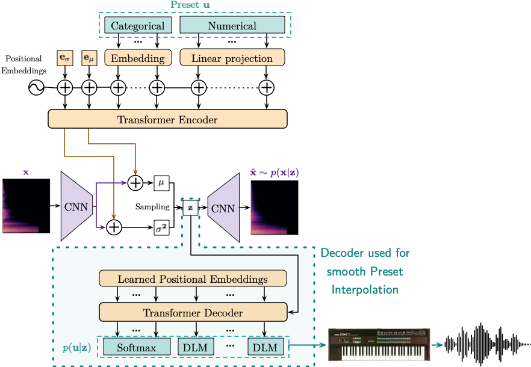

# SPINVAE - Synthesizer Preset Interpolation VAE

## Introduction

Official implementation of *Synthesizer Preset Interpolation using 
Transformer Auto-Encoders*, accepted to ICASSP 2023: [https://doi.org/10.1109/ICASSP49357.2023.10096397](https://doi.org/10.1109/ICASSP49357.2023.10096397).

The [supplemental material](https://gwendal-lv.github.io/spinvae/) provides examples of interpolations and extrapolations.



## Getting started

### Dependencies

- Python dependencies can be found in ```requirements.txt```.

- The models need to synthesize sound using external synthesizers.
[RenderMan](https://github.com/fedden/RenderMan) helps to render audio from VST 
plug-ins using Python code.
The setup procedure is highly dependent on your current system configuration
(Python interpreter, JUCE and Boost versions, etc.).
Please refer to the [RenderMan repo](https://github.com/fedden/RenderMan) to get help.
A symlink to your ```librenderman.so``` file must be provided in the ```synth``` directory.

- This project focuses on FM synthesis and requires a working 
[Dexed](https://github.com/asb2m10/dexed) (Yamaha DX7 software clone) plugin. 
A symlink to your ```Dexed.so``` plugin must be provided in the ```synth``` directory.
We have been using Dexed v0.9.3.

- Logs (losses, figures, ...) use [Comet ML](https://www.comet.com/site/)

### Configuration

A ```config_confidential.py``` file must be created in the ```utils``` directory. 
Please check instructions in ```config.py```.

### Data

#### DX7 presets

A dataset of 30k DX7 presets is provided as a ```dexed_presets.sqlite``` database. 
It is already available in the ```synth``` directory.

However, for training, it has to be rendered to audio files.
Please check the ```data/regenerate.py``` script, modify it if needed, then run it to 
generate the audio files and spectrograms 
(approximately 500GB with default data augmentation settings).

#### NSynth and Surge

The CNN-based spectrogram encoder and decoder can be pre-trained from an extended dataset
which also contains the [NSynth dataset](https://magenta.tensorflow.org/datasets/nsynth), 
and a dataset of audio files rendered using the [Surge synthesizer](https://github.com/surge-synthesizer).

A custom Surge build provides a Python interface to program presets and render audio.
The build path must be updated in the ```synth/surge.py``` file. 
We have been using Surge v1.9.0.

## Pre-trained model

The spectrogram auto-encoding modules (CNN encoder and CNN decoder) have been
pre-trained using the merged Dexed, NSynth and Surge datasets.
The PyTorch model checkpoint, as well as the corresponding configuration files
can be [downloaded here](https://drive.google.com/file/d/12TnsXvWBIySIMtuaE5WnzY4w-ip03xAi/view?usp=share_link).
If you use this checkpoint, NSynth and Surge are not necessary.

## Training

See ```train.py```.
Training configuration can be modified by editing ```config.py```.

The SPINVAE model from the paper can be trained using the pre-trained checkpoint above, 
and the current values in ```config.py```.
However, if you only wish to evaluate or use it, you can load it from a 
[downloadable checkpoint](https://drive.google.com/file/d/1IlmOpt1qsDglw4WjwemhoxIm9TkgO5kX/view?usp=share_link).

## Evaluation

After training, the interpolation performance can be evaluated using 
the [Timbre Toolbox](https://github.com/VincentPerreault0/timbretoolbox) for Matlab.
The ```matlab``` command must be available on your system.
Timbre Toolbox scripts should be stored in ```~/Documents/MATLAB/timbretoolbox```, 
or a custom path can be provided in ```evaluation/interpbase.py```.

## Citing

If you use our work, please cite the ICASSP 2023 paper:

```
@INPROCEEDINGS{10096397,
  author={Le Vaillant, Gwendal and Dutoit, Thierry},
  booktitle={ICASSP 2023 - 2023 IEEE International Conference on Acoustics, Speech and Signal Processing (ICASSP)}, 
  title={Synthesizer Preset Interpolation Using Transformer Auto-Encoders}, 
  year={2023},
  volume={},
  number={},
  pages={1-5},
  doi={10.1109/ICASSP49357.2023.10096397}}

```

